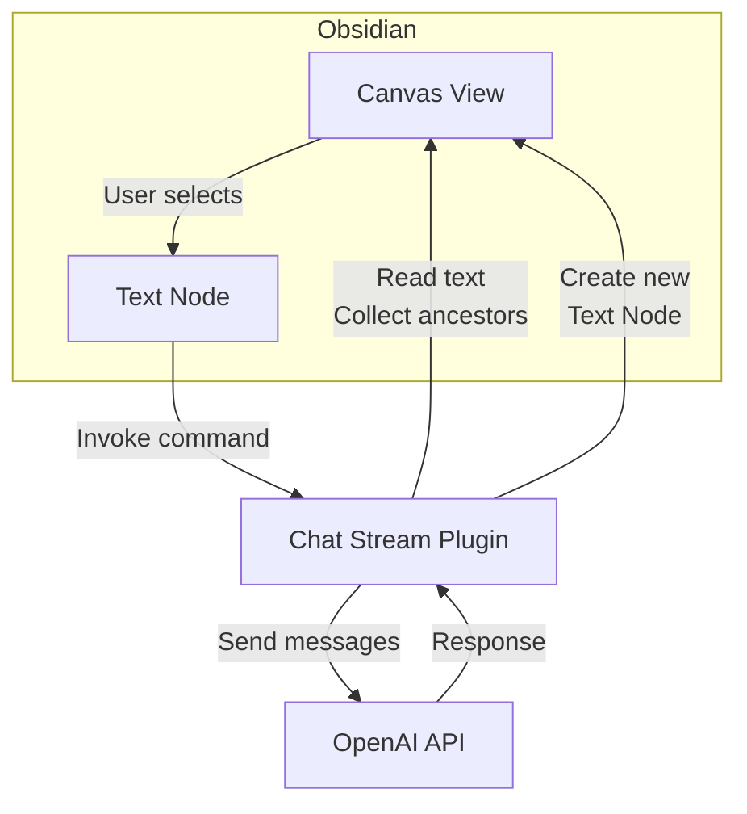
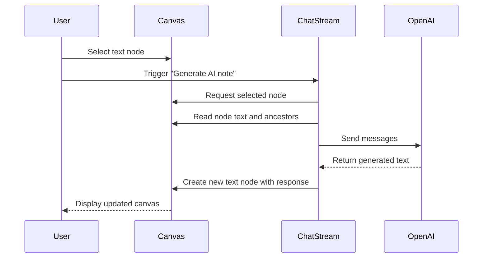

# Obsidian Chat Stream Architecture

This document describes how the Chat Stream plugin interacts with Obsidian Canvas and the OpenAI API. The diagrams below illustrate the main components and the message flow when generating a new AI note.

## Component Overview

The plugin reads the selected canvas node and its ancestors. It then builds a chat message array and calls the OpenAI API. The resulting text is inserted back into Canvas as a new text node next to the current selection.

## Sequence Diagram

The user selects a node and invokes the plugin command. The plugin gathers the necessary context from the canvas, calls the language model, and inserts the AI's reply as a new canvas node.

